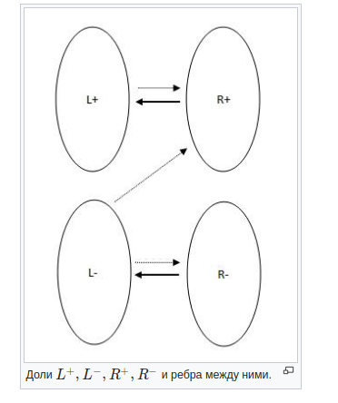
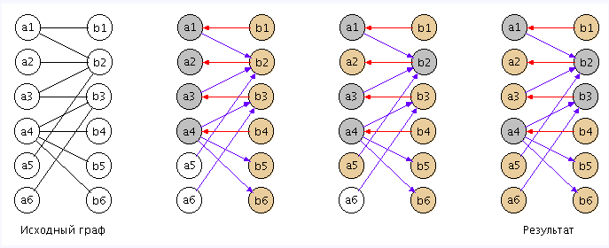

### Минимальное контролирующее множество

Пусть в G построено максимальное паросочетание.
Ориентируем ребра паросочетания, чтобы они шли из правой доли в левую, ребра не из паросочетания — так, чтобы они шли из левой доли в правую. Запустим обход в глубину из всех не насыщенных паросочетанием вершин левой доли. Разобьем вершины каждой доли графа на два множества: те, которые были посещены в процессе обхода, и те, которые не были посещены в процессе обхода.
Тогда L=(L+)∪(L−), R=(R+)∪(R−), где L, R — правая и левая доли соответственно, L+, R+ — вершины правой и левой доли, посещенные обходом, L−,R− — не посещенные обходом вершины. Тогда в G могут быть следующие ребра:

### Аогоритм

1. Построить максимальное паросочетание.
2. Ориентировать ребра:
   a). Из паросочетания — из правой доли в левую.
   b). Не из паросочетания — из левой доли в правую.
3. Запустить обход в глубину из всех свободных вершин левой доли, построить множества L+,L−,R+,R−.
4. В качестве результата взять (L−)∪(R+).